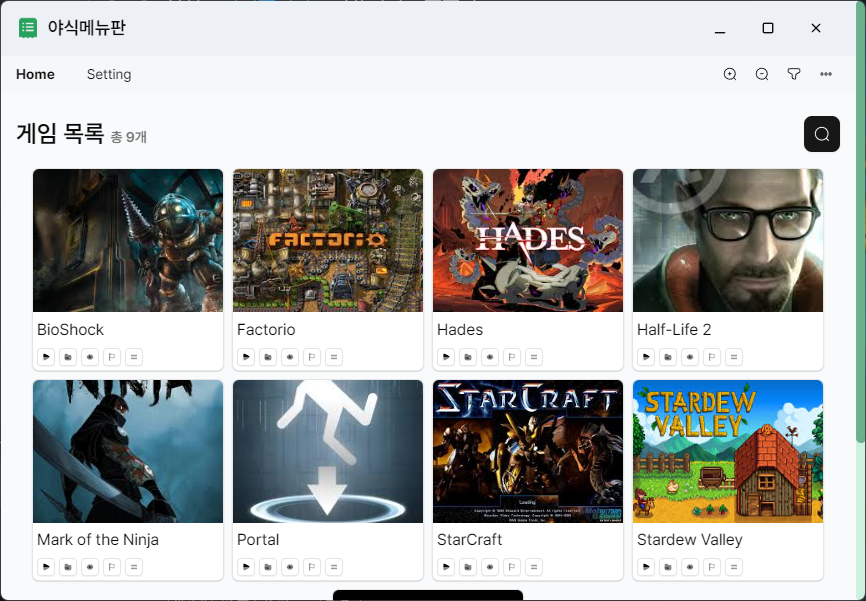

# 야식 메뉴판

**야식 메뉴판**은 게임을 효율적으로 관리하고 실행할 수 있는 간단한 데스크톱 애플리케이션입니다. 게임 폴더를 조회하고 썸네일을 다운로드 및 조회하며, 게임을 실행하거나 폴더 위치를 열 수 있는 기능을 제공합니다.

## 주요 기능 ✨

- 게임 목록 조회
- 썸네일 다운로드 및 조회
- 게임 실행
- 게임 폴더 위치 열기

## 설치 방법 🛠️

[릴리즈](https://github.com/qqoro/yasig-menu/releases)에서 앱을 다운로드 받은 후 설치할 수 있습니다. 또한 포터블 버전도 같이 제공합니다.

## 스크린샷 📸

## 라이선스 📜

이 프로젝트는 [MIT 라이선스](LICENSE)를 따릅니다. 자유롭게 사용하고 수정할 수 있습니다.

## 문의 📬

프로젝트와 관련된 문의는 Issues 탭을 통해 남겨주세요!
